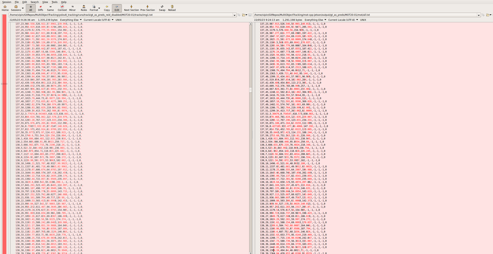

# Accuracy Analysis

To evaluate the accuracy of the BoT-SORT tracker, the Multiple Object Tracking (MOT) metrics were employed. The MOT metrics were calculated using a script adopted from [py-motmetrics](https://github.com/cheind/py-motmetrics), a Python project dedicated for benchmarking multiple object trackers.

## Data Used for Analysis

The MOT Ground Truth provided by the MOT benchmark for 4 sequences (MOT-20-01, MOT-20-02, MOT-20-03, and MOT-20-05) was used as a prediction for both the Python and C++ tracking code. The Re-ID module was disabled in the Python version and a common Python script was used to calculate MOT metrics for both Python and C++ produced results.

## Key Results

| Input Sequence | Tracking Algorithm                                   | #Frames | #GT | #Predictions | MOTP  | MOTA  | IDF1   | ID-Switches | Precision | Recall | TP   | Predictions - FP | FP | FN |
|----------------|------------------------------------------------------|---------|-----|--------------|-------|-------|--------|-------------|-----------|--------|------|------------------|----|----|
| MOT-20-01      | BoT-SORT (without Re-ID CNN): Reference Python project   | 429     | 26647 | 26610        | 1.1175| 99.8611| 99.3184 | 0           | 100.00   | 99.8611| 26610 | 0                | 0  | 37 |
| MOT-20-01      | BoT-SORT (without Re-ID CNN): C++ implementation        | 429     | 26647 | 26610        | 3.5014| 99.8536| 98.8189 | 2           | 100.00   | 99.8611| 26610 | 0                | 0  | 37 |
| MOT-20-02      | BoT-SORT (without Re-ID CNN): Reference Python project   | 2782    | 202215 | 201973     | 0.7853| 99.8803| 98.4344 | 0           | 100.00   | 99.8803| 201973| 0                | 0  | 242 |
| MOT-20-02      | BoT-SORT (without Re-ID CNN): C++ implementation        | 2782    | 202215 | 201972     | 2.6858| 99.8630| 97.9408 | 20          | 99.9965  | 99.8764| 201965| 7                | 7  | 250 |
| MOT-20-03      | BoT-SORT (without Re-ID CNN): Reference Python project   | 2405    | 356728 | 356003     | 1.0984| 99.7892| 99.1364 | 27          | 100.00   | 99.7968| 356003| 0                | 0  | 725 |
| MOT-20-03      | BoT-SORT (without Re-ID CNN): C++ implementation        | 2405    | 356728 | 356069     | 2.3445| 99.7881| 99.6073 | 27          | 99.9902  | 99.8055| 356034| 35               | 35 | 694 |
| MOT-20-05      | BoT-SORT (without Re-ID CNN): Reference Python project   | 3315    | 751330 | 750247     | 0.7992| 99.8509| 99.8243 | 37          | 100.00   | 99.8559| 750247| 0                | 0  | 1083 |
| MOT-20-05      | BoT-SORT (without Re-ID CNN): C++ implementation        | 3315    | 751330 | 750345     | 2.2765| 99.8644| 99.6920 | 18          | 99.9989  | 99.8678| 750337| 8                | 8  | 993 |

## Conclusions

- While both versions provide almost identical results due to the ground truth being used as predictions, we can observe a small variation in some metrics. This could be due to differences in how the two programming languages handle numerical computations
- It can be inferred that the tracking algorithm has been successfully ported to C++ from Python with very high fidelity
- It is observed that the MOTP (Multiple Object Tracking Precision) is quite low for both the Python and C++ implementations of the tracker. According to the literature, higher numbers indicate better accuracy for MOTP. The reason for the low MOTP score in this case is due to the definition of MOTP used in py-motmetrics. It is calculated as average distance over number of assigned objects. To convert this to a percentage, like in the MOTChallenge benchmarks, we would compute `(1 - MOTP) * 100`.
- The change in MOTP seems to be due to the precision errors (as can be seen in the screenshot attached below)
  - Left: Python output for MOT20-01 sequence
  - Right: C++ output for MOT20-01 sequence
  - Text format: `frame_no, object_id, bb_left, bb_top, bb_width, bb_height, score, X, Y, Z`
  - The minor precision mismatch between Python and C++ floating point numbers is adding up to result in MOTP mismatch

