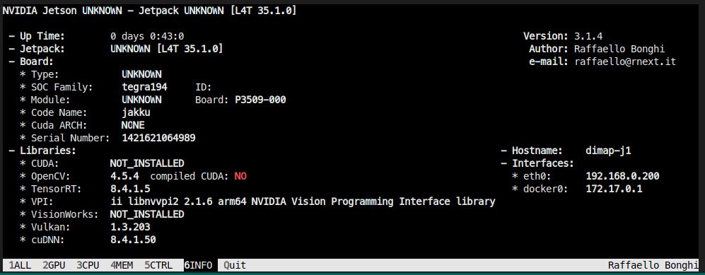
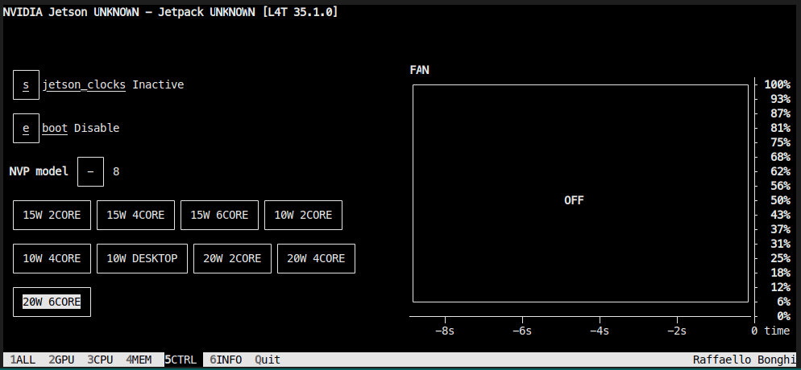

# Performance Analysis Report

## Test settings

- MOT-20 train dataset, sequence MOT20-01 having 429 frames and MOT20-05 having 3315 frames were used
- **MOT GT provided as predictions to tracking algorithm**
- Code execution speed (ms or FPS) have been reported using the ‘Release’ build

## Profiling System Specifications

### Host Machine

- OS: Ubuntu 20.04.6 LTS
- CPU: Intel(R) Core(TM) i7-13700F
- RAM: 32 GB

### Jetson-NX

- Installed libraries
  - Eigen (libeigen3-dev): 3.3.7-2
  - CMake: 3.26.4
  - System level libraries (i.e. pre-installed with Jetpack Image)

  

  - System power mode settings
    - Power Mode: 20W 6Core
    - Jetson Clocks: Inactive

  

## Profiling Results

- **Re-ID**: This is the CNN used for visual feature extraction. It has not been implemented in C++ codebase
- **Camera Motion Estimation**: uses sparse optical flow to find homography matrix between previous and current frame of the video sequence
  - Applied per frame, hence the similar time b/w the 2 sequences is expected
- **Motion Compensation**: Applies motion compensation using the homography matrix predicted by camera motion estimation algorithm
  - If camera motion estimation is disabled and motion compensation is enabled, identity matrix is used to do the same motion compensation calculation
  - Applied per box, hence higher time for sequence with higher bounding boxes is expected
- **Kalman Filter**: State prediction algorithm used in the BoT-SORT tracking algorithm

### **Execution time of different modules (Host Machine, Release Build, Best of 3)**

| Sequence | Average Objects/Frame | Re-ID | Camera Motion Estimation | Motion Compensation | Kalman Filter | Algorithm Execution Time (ms) | Algorithm Execution FPS | Removed Module | Estimated time for the removed module |
| --- | --- | --- | --- | --- | --- | --- | --- | --- | --- |
| MOT20-01 | 62 | ❌ | ✅ | ✅ | ✅ | 4.7771 | 209.3333 | N/A | N/A |
| MOT20-01 | 62 | ❌ | ❌ | ✅ | ✅ | 0.2074 | 4819.2466 | Camera Motion Estimation | 4.7771 - 0.207431 = 4.5696 |
| MOT20-01 | 62 | ❌ | ❌ | ❌ | ✅ | 0.2016 | 4959.9266 | Motion Compensation | 0.20743 - 0.20163 = 0.0058 |
| MOT20-05 | 226 | ❌ | ✅ | ✅ | ✅ | 6.6817 | 149.6633 | N/A | N/A |
| MOT20-05 | 226 | ❌ | ❌ | ✅ | ✅ | 2.0498 | 487.9570 | Camera Motion Estimation | 6.6817 - 2.0498 = 4.6319 |
| MOT20-05 | 226 | ❌ | ❌ | ❌ | ✅ | 2.0054 | 498.6453 | Motion Compensation | 2.0498 - 2.0054 = 0.0414 |

### **Execution time of different modules (Jetson-NX, Release Build, Best of 3)**

| Sequence | Avg Objects/image | Re-ID | Camera Motion Estimation | Motion Compensation | Kalman Filter | Algorithm Execution Time (ms) | Algorithm Execution FPS | Removed Module | Estimated time for the removed module |
| --- | --- | --- | --- | --- | --- | --- | --- | --- | --- |
| MOT20-01 | 62 | ❌ | ✅ | ✅ | ✅ | 39.9968 | 25.0229 | N/A | N/A |
| MOT20-01 | 62 | ❌ | ❌ | ✅ | ✅ | 2.6441 | 378.2070 | Camera Motion Estimation | 39.9968 - 2.6441 = **37.3527** |
| MOT20-01 | 62 | ❌ | ❌ | ❌ | ✅ | 2.5185 | 397.0786 | Motion Compensation | 2.6441 - 2.5185 = **0.1256** |
| MOT20-05 | 226 | ❌ | ✅ | ✅ | ✅ | 52.4251 | 19.0749 | N/A | N/A |
| MOT20-05 | 226 | ❌ | ❌ | ✅ | ✅ | 15.6337 | 63.9844 | Camera Motion Estimation | 52.4251 - 15.6337 = **36.7914** |
| MOT20-05 | 226 | ❌ | ❌ | ❌ | ✅ | 14.7918 | 67.7275 | Motion Compensation | 15.6337 - 14.7918 = **0.8419** |

## Conclusions

- The Camera Motion Estimation function is the most time-consuming part of the program, both in the Release and Debug builds. In the Release build, it occupies 97.1% of the total execution time.
- Despite having a significant role in the tracking algorithm, the Kalman Filter function takes minimal time for execution. This is consistent across both Release and Debug builds.
- A variation in the number of boxes being tracked due to confidence thresholds significantly impacts the performance of the tracking algorithm
- Future optimizations, if necessary, can consider focusing on the Camera Motion Estimation function due to its large impact on overall performance.
